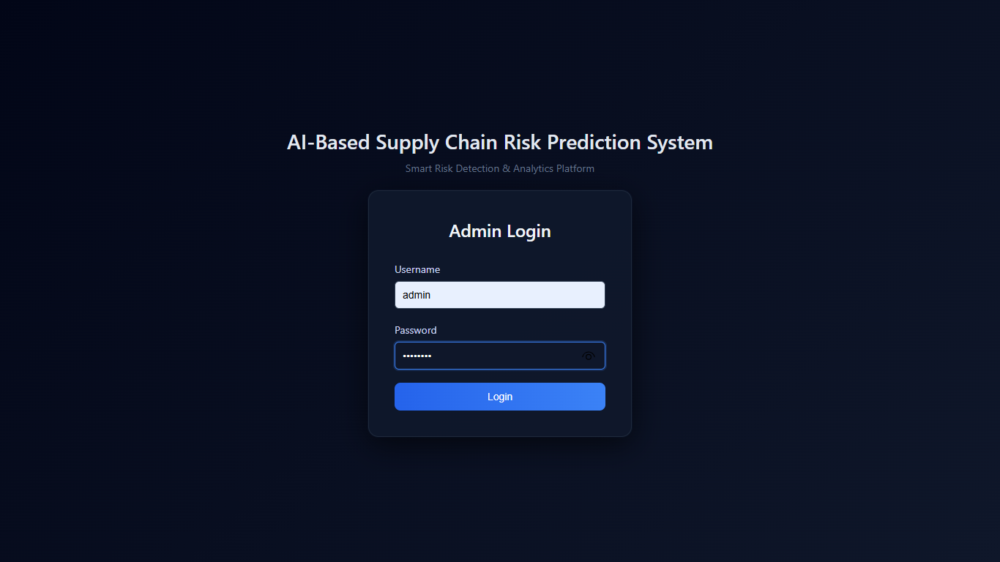

````markdown
# 🚀 AI-Based Supply Chain Risk Prediction System

Developed an AI-powered web application to predict supply chain risks using a Random Forest machine learning model. Implemented manual data entry and CSV upload for bulk risk prediction, classifying results into Low, Medium, and High risk levels with confidence scores. Built an interactive dashboard featuring KPIs, charts, prediction history, search, filtering, and export options (Excel and dashboard image). Stored prediction data in SQLite and developed the application using Flask, Python, HTML, CSS, JavaScript, Bootstrap, Pandas, Scikit-learn, Chart.js, and SQLite.

---

## ✨ Features

- 🔐 Admin Login
- 📊 Interactive Dashboard
- 🤖 AI-Based Risk Prediction
- 📂 Manual Data Entry
- 📄 CSV Upload Prediction
- 📈 Prediction Confidence Score
- 📉 Real-Time Charts & Analytics
- 📜 Prediction History
- 📥 Export Excel Reports
- 🖼 Export Dashboard as Image
- 💾 SQLite Database Storage

---

## 🛠 Technologies Used

### Frontend
- HTML5
- CSS3
- JavaScript
- Bootstrap
- Chart.js

### Backend
- Python
- Flask

### Machine Learning
- Scikit-learn
- Pandas
- NumPy
- Joblib

### Database
- SQLite

---

## 📂 Project Structure

```
ai_supply_chain_risk_prediction/
│
├── app.py
├── requirements.txt
├── config.py
│
├── model/
│   ├── train_model.py
│   ├── risk_model.pkl
│   └── reports/
│
├── database/
│   ├── database.db
│   └── db_setup.py
│
├── data/
│   └── supply_chain_data.csv
│
├── uploads/
│
├── Downloads/
│
├── static/
│   ├── css/
│   └── js/
│
├── templates/
│
└── utils/
    ├── excel_export.py
    └── predictor.py
```

---

## ⚙️ Installation

### Clone Repository

```bash
git clone https://github.com/CodeWithDeveeswar/ai_supply_chain_risk_prediction.git
```

### Open Project

```bash
cd ai-supply-chain-risk-prediction
```

### Install Dependencies

```bash
pip install -r requirements.txt
```

---

## ▶️ Run Database Setup

```bash
python database/db_setup.py
```

---

## 🧠 Train Machine Learning Model

```bash
python model/train_model.py
```

The training process generates:

- risk_model.pkl
- Confusion Matrix
- Feature Importance Graph
- Model Performance Report

---

## ▶️ Run Application

```bash
python app.py
```

Open your browser:

```
http://127.0.0.1:5000
```

---

## 🔑 Default Admin Login

| Username | Password |
|----------|----------|
| admin | admin123 |

---

## 📊 Machine Learning Model

Algorithm Used:

- Random Forest Classifier

Model Evaluation:

- Accuracy
- Balanced Accuracy
- Classification Report
- Confusion Matrix
- Feature Importance
- Prediction Confidence Score

---

## 📈 Dashboard

The dashboard includes:

- Total Predictions
- Risk Distribution
- Region Distribution
- Transport Mode Analysis
- Weather Impact
- Demand Analysis
- Fuel Cost Analysis
- Traffic vs Delay
- High Risk Suppliers
- Order Value Trend

---

## 📂 Prediction Input

The system accepts:

- Supplier Name
- Region
- Transport Mode
- Delay
- Weather
- Demand
- Inventory
- Traffic
- Port Delay
- Order Value
- Fuel Cost

---

## 📤 Export Features

- Excel Report Export
- Dashboard Image Export
- CSV Upload Backup

---

## 📸 Screenshots

- Login Page

- Dashboard
- Prediction Form
- Prediction Result
- Prediction History
- Model Performance Reports

---

## 📁 Reports Generated

- Confusion Matrix
- Feature Importance
- Classification Report
- Prediction History
- Dashboard Report

---

## 🔒 Security Features

- Admin Authentication
- Server-side Validation
- Secure Database Storage
- Protected Routes
- Flash Messages
- Input Validation

---

## 🚀 Future Enhancements

- Multiple User Roles
- Email Notifications
- Cloud Database Integration
- Live API Data Integration
- Deep Learning Models
- Mobile Responsive Dashboard
- REST API Support

---

## 👨‍💻 Author

**Deveeswar K**

MCA Student

AI-Based Supply Chain Risk Prediction System

---

## 📄 License

This project is developed for academic and learning purposes.
````
